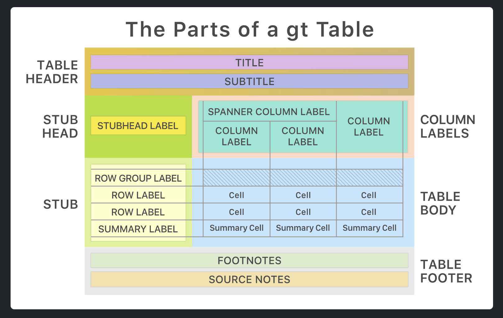

```{r setup, echo=FALSE, warning=FALSE, message=FALSE}
knitr::opts_chunk$set(echo = TRUE, eval=FALSE, warning = FALSE, message = TRUE)
library(cowsay)
```

```{r}
say("MPAs - Are they worth the swim?", "fish")
```

------------------------------------------------------------------------

### Open source data & applied study:

Open access data was utilized for this class exercise from the study (Moland et al., 2013):

> Moland, Even, et al. (2013). *Lobster and cod benefit from small-scale northern marine protected areas: inference from an empirical before–after control-impact study.* Proceedings of the Royal Society B: Biological Sciences. https://doi.org/10.1098/rspb.2012.2679

------------------------------------------------------------------------

### Coding Goals

#### 1.  Make a pretty table

#### 2.  Make a pretty figure

#### 3.  Explore fate of Norwegian lobster

#### 4.  Have fun!

------------------------------------------------------------------------

```{r}

library(tidyverse); library(janitor); library(here)   
library(gt); library(praise); library(fortunes)
library(cowsay); library(beepr); library(usethis)
library(randomNames); library(colourpicker); library(RColorBrewer)

```

```{r}
say("Let's get started!", "buffalo")
```

------------------------------------------------------------------------

### Read in the 🦞 data → → → `moland13_lobsters.csv`

```{r data-in}

lob_data <- read_csv(here("data", "moland13_lobsters.csv")) %>% 
    mutate(year = factor(year)) %>% 
    mutate(region= factor(region))

```

**Variable description:**

- `year` (5-levels): Years measured from 2006 to 2010
- `region` (3-levels): `bol`= Bolærne , `kve` = Kvernskjær , `flo` = Flødevigen
- `treat` (2-levels): `mpa` = treatment , `con` = control
- `cpue`: "Catch per unit effort"

------------------------------------------------------------------------

### Make pretty tables with the {`gt`} package



Create a table with total CPUE for each year and region
```{r}

tbl_2way <- lob_data %>%

    
```

Customize table using gt
```{r}

tbl_2way %>% 


# title = "Total CPUE by Region and Year",
# subtitle = "Total catch per unit effort by year and region" 
# 
# bol = "Bolærne"
# flo = "Kvernskjær"
# kve = "Flødevigen"
#   
# "Source: Moland et al., 2013"

```

```{r}
say("Create more tables we must", "yoda")
```

------------------------------------------------------------------------

### Create a table with total CPUE by `year`, `region`, and `treatment`

Wrange data for 3-way table
```{r}
tbl_3way <- lob_data %>%

```

Customize table using {`gt`}
```{r}

tbl_3way %>%


  # title = "Total CPUE by Region, Treatment, and Year",
  # subtitle = "Aggregated totals of CPUE by year for each region and treatment"
  # label = "Bolærne",
  # columns = c("bol_con", "bol_mpa")
  # label = "Flødevigen",
  # columns = c("flo_con", "flo_mpa")
  # label = "Kvernskjær",
  # columns = c("kve_con", "kve_mpa")

  # cols_label(
  #   bol_con = "Control",
  #   bol_mpa = "MPA",
  #   flo_con = "Control",
  #   flo_mpa = "MPA",
  #   kve_con = "Control",
  #   kve_mpa = "MPA") %>% 
  # data_color(
  #   columns = c("bol_con", "flo_con", "kve_con"),
  #   colors = scales::col_numeric(
  #     palette = c("blue"),
  #     domain = NULL)) %>% 
  # data_color(
  #   columns = c("bol_mpa", "flo_mpa", "kve_mpa"),
  #   colors = scales::col_numeric(
  #     palette = c("red"),
  #     domain = NULL))
```

```{r}
beep(1); praise("${Exclamation}!- You've ${created} something ${adjective}!")
```

```{r}
say("Time for plotting", "squirrel2")
```

------------------------------------------------------------------------

### Make pretty plots using {`ggthemes`}

```{r}
lob_size <- read_csv(here("data", "moland13_lobstersize.csv")) %>% 
    mutate(region = factor(region, labels = c("Kve", "Flo", "Bol"))) %>% 
    mutate(treat = factor(treat, labels = c("Control Sites", "MPA Sites")))
```

Create plot 
```{r}

lob_size %>% 

    
  # legend.position = "none",
  # plot.title = element_text(size = 16),
  # plot.subtitle = element_text(size = 12),
  # plot.caption = element_text(size = 12),
  # strip.text = element_text(size = 12, face = "bold", family = "mono"
```

Save plot figure
```{r}
ggsave(here("figures", "lbstr-ridge-plot.png"), dpi=300, height=5, width=7, units="in")
```

```{r}
say("I guess this is the END :) ", "stegosaurus"); beep(2) 
```

------------------------------------------------------------------------

### R Package Documentation & Examples 

1. {`gt`} package (Iannone et al., 2024):

https://gt.rstudio.com/articles/gt.html

2. {`janitor`} package (`adorn_`; Firke, 2023):  

https://sfirke.github.io/janitor/articles/tabyls.html#the-adorn_-functions

3. {`ggthemes`} package (Arnold, 2024):

https://jrnold.github.io/ggthemes/

```{r}
# More themes! 
?theme_economist()
?theme_fivethirtyeight()
?theme_wsj()
?theme_solarized()
```


4. {`cowsay`} package (Chamberlain & Dobbyn, 2024):

https://github.com/sckott/cowsay

```{r}
names(animals) # Check out all the animals!
```

5. {`praise`} package (Csardi & Sorhus, 2015)

```{r}
praise_parts
```

------------------------------------------------------------------------

```{r}
say("That's all folks!", "egret") 
```

------------------------------------------------------------------------


